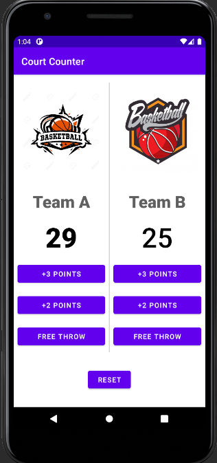

# Court_Counter
Court Counter app can be used to keep track of the scores during any kind of game (Basketball, Live Quiz, chess,etc.). 
### Description
Court Counter app made using java. 
-Court Counter can be used to keep track of the scores during any kind of game. It can also be used in live classroom quiz session to keep track of the scores of the teams. There is an option to reset the scores and start the next round of the game 

## Use The App
-> Download the given APK file into your phone and start using it.
-> Have Fun !!

### Tools and Languages Used:

 

## Getting Started
-----------------------
1. Learn to code using java 
2. Install Android Studio, if you don't already have it. 
3. Download the code from the given github repository. 
4. Import the code into Android Studio. 
5. Build and run the sample.  The user interface looks alike this: 

### Developed by:
<a href="https://github.com/sambit221">Sambit Kumar Tripathy</a>

